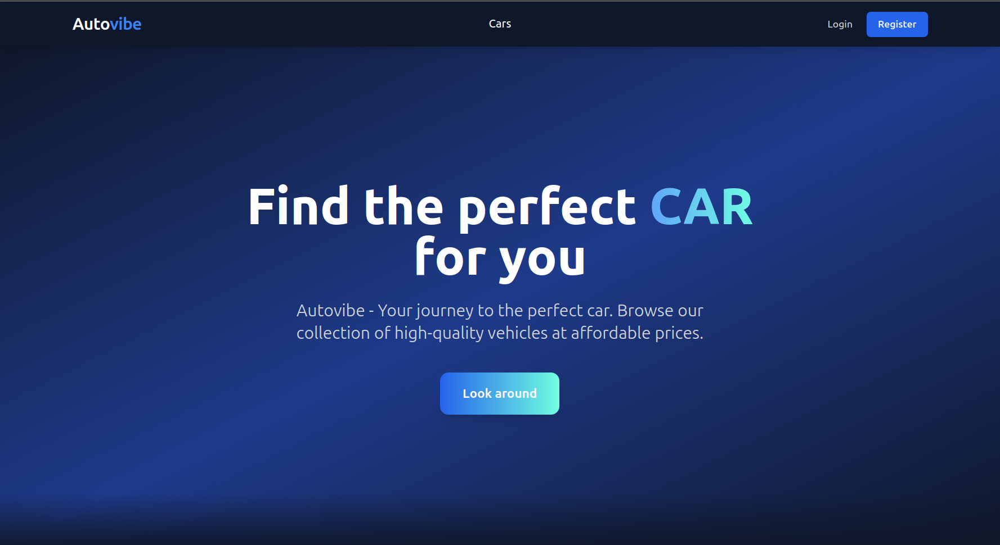

<p align="center">
  
</p>

# Autovibe

Small full-stack thing for car listings — .NET API + React (Vite). Auth, CRUD, image uploads. Nothing fancy.

**Stack:** ASP.NET Core, EF Core + Pomelo (MySQL), JWT, FluentValidation on the backend. React 19, Redux, RHF, Axios on the frontend.

If the banner image above breaks after you rename files, point the `` at whatever you committed (paths are relative to repo root).

## What you need installed

.NET 8 SDK, Node 18+, MySQL running somewhere. `dotnet-ef` only if you want migrations instead of importing the SQL script: `dotnet tool install --global dotnet-ef`.

## Layout

```
backend/Autovibe.API/   — API, migrations, setup_database.sql
frontend/             — Vite app
```

If you cloned into a folder that already contains another copy of the same repo, don’t edit the nested duplicate by mistake.

## Backend

Secrets aren’t in `appsettings.json` — set connection string + JWT key via user secrets (or env in prod). From `backend/Autovibe.API`:

```bash
dotnet user-secrets init   # once
dotnet user-secrets set "ConnectionStrings:DefaultConnection" "Server=...;Database=autovibe;..."
dotnet user-secrets set "Jwt:Key" "<long random string>"
```

MS docs: https://learn.microsoft.com/en-us/aspnet/core/security/app-secrets

CORS for local dev is `Cors:AllowedOrigins` in `appsettings.json` (defaults to `http://localhost:5173`). Bump it if Vite isn’t on 5173.

**DB:** create database + user, then either import `setup_database.sql` with mysql client, or `dotnet ef database update` from `backend/Autovibe.API`.

**Admin (JWT `Admin` role):** users have a `Role` in the DB (`User` / `Admin`). First admin: register a user, then `UPDATE Users SET Role = 'admin' WHERE Email = '...';` (values are stored lowercase) and log in again for a new token. Endpoints (all require `Authorization: Bearer …` and `Admin` unless noted):

- `GET /api/Admin` — paged user list: `pageNumber`, `pageSize` (defaults 1 / 18), optional `email` (contains filter). Returns `PageResponse` like cars.
- `PATCH /api/Admin/{id}/role` — `{id}` is a **user** id. Body `{ "role": 0 | 1 }` (enum: `Admin` = 0, `User` = 1). Cannot demote yourself or remove the last admin.
- `PATCH /api/Admin/{userId}/status` — `{userId}` is a **user** id. Block/unblock: `{ "isBlocked": true|false, "blockedUntil": "...", "blockReason": "..." }`. Users are blocked if `isBlocked=true` **or** `blockedUntil` is in the future.
- `GET /api/Admin/deleted` — soft-deleted car listings. Returns a JSON array of **`CarListDto`** (same general shape as `GET /api/cars`, including `shortDescription`, `isDeleted`, `deletedAt`, `userId`, `imageUrls`), ordered by deletion time. Not raw EF entities.
- `DELETE /api/Admin/{id}` — `{id}` is a **car** id. **Hard** delete (only if the listing is already soft-deleted). Returns `204 No Content`.
- `PATCH /api/Admin/{id}/restore` — `{id}` is a **car** id. Undo soft-delete on that car (and restores related soft-deleted favorites). Returns `200` with `true` on success.

**Moderation on listings:** an admin may also call `PUT /api/cars/{id}` and `DELETE /api/cars/{id}` like the owner (JWT must include the `Admin` role). Soft-deleted cars are hidden from normal queries; use `/api/Admin/deleted` and restore/hard-delete there instead.

Swagger (`/swagger` in Development): use **Authorize** with the raw JWT, or test with Postman/curl.

- JWT secret was rotated and secrets were removed from repo config — make sure you set `Jwt:*` via user-secrets / env.
- Rate limiting was adjusted to work behind proxies.
- FluentValidation auto-validation adapters were removed; validators are registered via DI and `JwtSettings` is validated on startup.

## Tests (backend)

From repo root:

```bash
dotnet test backend/Autovibe.API.Tests/Autovibe.API.Tests.csproj -c Release
```

Notes:
- **Integration tests** use `WebApplicationFactory` + **EF InMemory DB** (see `backend/Autovibe.API.Tests/CustomWebApplicationFactory.cs`).
- There is an **end-to-end smoke test** that hits every controller at least once: `AllEndpointsSmokeTests`.
- The smoke test exercises `POST /api/cars/upload-image` with a tiny PNG; it can create files under `backend/Autovibe.API/wwwroot/images/cars/` if your test host runs with a real webroot. If you see untracked PNGs, don’t commit them.

## Frontend

You need `VITE_API_URL` or the app dies on startup (see `frontend/src/services/api.ts`). Example `frontend/.env`:

```env
VITE_API_URL=http://localhost:5258
```

No `/api` at the end — the axios instance adds `/api`. Vite dev server proxies `/api` to that host (`vite.config.ts`).

```bash
cd frontend && npm install && npm run dev
```

Opens on **5173** by default.

## Running locally

1. MySQL up, schema applied.
2. User secrets set for API.
3. `frontend/.env` exists with `VITE_API_URL`.

Then:
- Terminal 1: `cd backend/Autovibe.API && dotnet run` → API (usually **5258**, check launch settings if it differs).
- Terminal 2: `cd frontend && npm run dev`.

## Random commands

`npm run build` / `npm run lint` — frontend. `dotnet publish -c Release` — API. After model changes: `dotnet ef migrations add Whatever` from the API project.

## Images

Authenticated upload: `POST /api/cars/upload-image`. Files go under `wwwroot/images/cars/`, API returns paths like `/images/cars/...`. Frontend builds full URLs with `getImageUrl` + same base as `VITE_API_URL` — if images 404, that’s usually the first place to check.

## Production

Publish API, `npm run build` for frontend (`frontend/dist/`). Set real connection string + JWT in your host’s env/secret store. Build the frontend with `VITE_API_URL` pointing at your **public** API URL. Fix CORS for your real frontend origin.

## When something’s wrong

- **Blank error on app load** — missing `VITE_API_URL`.
- **401** — not logged in or token expired.
- **CORS** — origin in backend config doesn’t match where you opened the app.
- **Images broken** — wrong base URL or static files not served from `wwwroot`.
